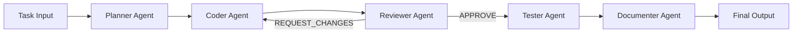

# MiMo Multi-Agent DevAssistant

> **AI-powered multi-agent development pipeline built on Xiaomi MiMo V2.5 models.**

A production-grade orchestration platform that coordinates specialized AI agents for automated code development — from planning to code generation, review, testing, and documentation — using the full suite of Xiaomi MiMo V2.5 models.

---

## Architecture

```
┌─────────────────────────────────────────────────────────┐
│                    Orchestrator Agent                   │
│           Coordinates pipeline & manages state          │
└──────┬──────┬──────┬──────┬──────┬──────────────────────┘
       │      │      │      │      │
       ▼      ▼      ▼      ▼      ▼
   ┌───────┐┌──────┐┌───────┐┌──────┐┌──────────┐
   │Planner││Coder ││Review ││Tester││Documenter│
   │ Agent ││Agent ││ Agent ││Agent ││  Agent   │
   └───┬───┘└──┬───┘└───┬───┘└──┬───┘└────┬─────┘
       │       │        │       │         │
       ▼       ▼        ▼       ▼         ▼
   ┌───────────────────────────────────────────────┐
   │           MiMo API Client (OpenAI-compatible) │
   ├───────────────┬───────────────┬───────────────┤
   │ MiMo-V2.5-Pro │   MiMo-V2.5  │ MiMo-V2.5-TTS│
   │  (Reasoning)  │ (Multimodal) │   (Speech)    │
   └───────────────┴───────────────┴───────────────┘
```

### Agent Roles

| Agent | Model | Purpose |
|-------|-------|---------|
| **Planner** | MiMo-V2.5-Pro | Decomposes tasks into structured implementation plans |
| **Coder** | MiMo-V2.5-Pro | Generates production-ready code from plans |
| **Reviewer** | MiMo-V2.5-Pro | Multi-dimensional code review (security, performance, correctness) |
| **Tester** | MiMo-V2.5-Pro | Generates comprehensive test suites with pytest |
| **Documenter** | MiMo-V2.5 | Creates documentation with multimodal understanding |
| **Narrator** | MiMo-V2.5-TTS | Voice narration for code reviews and docs |

### Pipeline Flow



The pipeline includes **iterative refinement**: if the Reviewer requests changes, the Coder automatically revises the code and re-submits for review, up to a configurable number of iterations.

---

## Features

- **Multi-Agent Orchestration**: Coordinated pipeline with specialized agents that communicate via structured messages
- **Iterative Refinement**: Automated code improvement loop between Coder and Reviewer agents
- **Full MiMo V2.5 Integration**: Leverages all three model types:
  - **MiMo-V2.5-Pro** for deep reasoning and code generation
  - **MiMo-V2.5** for multimodal document understanding
  - **MiMo-V2.5-TTS** for voice narration
- **Multiple Interfaces**: CLI, REST API (FastAPI), and Web Dashboard (Streamlit)
- **Token Usage Tracking**: Real-time monitoring of API consumption across all agents
- **OpenAI-Compatible**: Uses the standard OpenAI SDK for MiMo API integration

---

## Quick Start

### Installation

```bash
# Clone the repository
git clone https://github.com/singgih123/mimo-multi-agent-devassistant.git
cd mimo-multi-agent-devassistant

# Install with pip
pip install -e ".[dev]"

# Set up environment
cp .env.example .env
# Edit .env with your MiMo API key from platform.xiaomimimo.com
```

### Get Your API Key

1. Visit [platform.xiaomimimo.com](https://platform.xiaomimimo.com)
2. Sign up / Log in
3. Navigate to API Keys
4. Create a new key and add it to your `.env` file

### Usage

#### CLI

```bash
# Run the full multi-agent pipeline
mimo-agent run "Build a REST API for user authentication with JWT tokens" \
  --title "Auth API" --language python

# Review existing code
mimo-agent review src/myapp/auth.py --language python

# Generate tests
mimo-agent test src/myapp/handlers.py

# Create an implementation plan
mimo-agent plan "Design a microservices architecture for an e-commerce platform"

# Check configuration
mimo-agent status
```

#### REST API

```bash
# Start the API server
uvicorn mimo_agents.api:app --host 0.0.0.0 --port 8000

# Run pipeline via API
curl -X POST http://localhost:8000/pipeline \
  -H "Content-Type: application/json" \
  -d '{
    "title": "Auth Service",
    "description": "Build JWT authentication service",
    "language": "python"
  }'

# Review code via API
curl -X POST http://localhost:8000/review \
  -H "Content-Type: application/json" \
  -d '{
    "code": "def login(user, pwd): return db.query(user, pwd)",
    "language": "python"
  }'
```

#### Web Dashboard

```bash
streamlit run src/mimo_agents/ui/dashboard.py
```

---

## Configuration

| Environment Variable | Default | Description |
|---------------------|---------|-------------|
| `MIMO_API_KEY` | *(required)* | Your MiMo API key |
| `MIMO_BASE_URL` | `https://api.xiaomimimo.com/v1` | MiMo API endpoint |
| `MIMO_REASONING_MODEL` | `MiMo-V2.5-Pro` | Model for reasoning tasks |
| `MIMO_MULTIMODAL_MODEL` | `MiMo-V2.5` | Model for multimodal tasks |
| `MIMO_TTS_MODEL` | `MiMo-V2.5-TTS` | Model for text-to-speech |

---

## Development

```bash
# Install dev dependencies
pip install -e ".[dev]"

# Run tests
pytest

# Lint
ruff check src/ tests/

# Type check
mypy src/
```

---

## How It Works

1. **Task Intake**: User describes a development task via CLI, API, or Web UI
2. **Planning Phase**: The Planner Agent uses MiMo-V2.5-Pro to decompose the task into structured sub-tasks with technology choices and complexity estimates
3. **Code Generation**: The Coder Agent generates production-ready code following the plan
4. **Review Loop**: The Reviewer Agent performs multi-dimensional analysis (correctness, security, performance, maintainability). If changes are needed, the Coder revises automatically
5. **Test Generation**: The Tester Agent creates a comprehensive pytest test suite
6. **Documentation**: The Documenter Agent uses MiMo-V2.5's multimodal capabilities to generate Markdown documentation with architecture diagrams
7. **Output**: All artifacts are collected and presented — code, tests, docs, and usage metrics

---

## Tech Stack

- **Python 3.10+** — Core language
- **OpenAI SDK** — MiMo API integration (OpenAI-compatible)
- **FastAPI** — REST API server
- **Streamlit** — Web dashboard
- **Rich** — Terminal UI
- **Click** — CLI framework
- **Pydantic** — Data validation
- **pytest** — Testing

---

## License

MIT License — see [LICENSE](LICENSE) for details.
